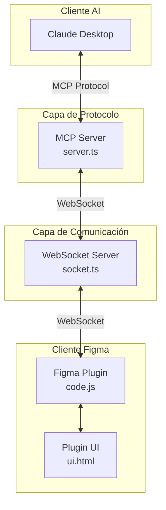

# Análisis Arquitectónico: Claude Talk to Figma MCP

## 📋 RESUMEN EJECUTIVO

**Claude Talk to Figma MCP** es un sistema de integración avanzado que permite a Claude Desktop interactuar directamente con Figma a través del protocolo Model Context Protocol (MCP). El proyecto implementa una arquitectura de microservicios distribuida con comunicación WebSocket bidireccional, diseñada para facilitar flujos de trabajo de diseño asistido por IA.

### Métricas del Proyecto
- **Líneas de código**: ~8,000+ líneas
- **Archivos TypeScript**: 15+ archivos
- **Herramientas MCP**: 40+ comandos especializados
- **Cobertura de funcionalidad**: Completa (CRUD + Análisis)
- **Arquitectura**: Microservicios con separación clara de responsabilidades

---

## 🔍 ANÁLISIS TÉCNICO DETALLADO

### 1. Arquitectura del Sistema



#### Principios Arquitectónicos Implementados

1. **Separation of Concerns**: Cada capa tiene responsabilidades específicas
   - MCP Server: Lógica de negocio, validación, defaults
   - WebSocket Server: Enrutamiento de mensajes
   - Figma Plugin: Traductor puro de comandos

2. **Single Responsibility Principle**: Cada módulo tiene una función específica
3. **Dependency Inversion**: Abstracciones bien definidas entre capas
4. **Event-Driven Architecture**: Comunicación asíncrona con manejo de eventos

### 2. Estructura Modular del Proyecto

```
src/
├── talk_to_figma_mcp/           # 🏗️ MCP Server Core
│   ├── server.ts                # Entry point principal
│   ├── config/                  # ⚙️ Configuración
│   │   └── config.ts           # CLI args, WebSocket config
│   ├── tools/                   # 🛠️ Herramientas MCP (5 módulos)
│   │   ├── index.ts            # Registro centralizado
│   │   ├── document-tools.ts   # Consulta de documentos
│   │   ├── creation-tools.ts   # Creación de elementos
│   │   ├── modification-tools.ts # Modificación de propiedades
│   │   ├── text-tools.ts       # Manipulación de texto
│   │   └── component-tools.ts  # Gestión de componentes
│   ├── utils/                   # 🔧 Utilidades
│   │   ├── websocket.ts        # Cliente WebSocket
│   │   ├── logger.ts           # Sistema de logging
│   │   ├── figma-helpers.ts    # Helpers específicos
│   │   └── defaults.ts         # Valores por defecto
│   └── types/                   # 📝 Definiciones TypeScript
│       ├── index.ts            # Tipos principales
│       └── color.ts            # Tipos de color
├── claude_mcp_plugin/           # 🎨 Plugin de Figma
│   ├── code.js                 # Lógica del plugin (3,296 líneas)
│   ├── manifest.json           # Configuración del plugin
│   └── ui.html                 # Interfaz de usuario
└── socket.ts                    # 🌐 Servidor WebSocket independiente
```

### 3. Análisis de Calidad del Código

#### Fortalezas Arquitectónicas

✅ **Tipado Estricto con TypeScript**
```typescript
// Ejemplo de tipado robusto
export interface CommandProgressUpdate {
  type: 'command_progress';
  commandId: string;
  commandType: string;
  status: 'started' | 'in_progress' | 'completed' | 'error';
  progress: number;
  totalItems: number;
  processedItems: number;
  message: string;
  payload?: any;
  timestamp: number;
}
```

✅ **Validación con Zod**
```typescript
// Validación robusta de parámetros
server.tool(
  "set_fill_color",
  "Set the fill color of a node in Figma",
  {
    nodeId: z.string().describe("The ID of the node to modify"),
    r: z.number().min(0).max(1).describe("Red component (0-1)"),
    g: z.number().min(0).max(1).describe("Green component (0-1)"),
    b: z.number().min(0).max(1).describe("Blue component (0-1)"),
    a: z.number().min(0).max(1).optional().describe("Alpha component (0-1)")
  }
)
```

✅ **Manejo de Errores Robusto**
```typescript
// Patrón de error handling consistente
try {
  const result = await sendCommandToFigma("get_document_info");
  return { content: [{ type: "text", text: JSON.stringify(result) }] };
} catch (error) {
  return {
    content: [{
      type: "text",
      text: `Error getting document info: ${error instanceof Error ? error.message : String(error)}`
    }]
  };
}
```

✅ **Sistema de Logging Estructurado**
```typescript
// Logger personalizado que evita interferir con stdout
export const logger = {
  info: (message: string) => process.stderr.write(`[INFO] ${message}\n`),
  debug: (message: string) => process.stderr.write(`[DEBUG] ${message}\n`),
  warn: (message: string) => process.stderr.write(`[WARN] ${message}\n`),
  error: (message: string) => process.stderr.write(`[ERROR] ${message}\n`)
};
```

#### Áreas de Mejora Identificadas

⚠️ **Plugin de Figma Monolítico**
- **Problema**: 3,296 líneas en un solo archivo `code.js`
- **Impacto**: Difícil mantenimiento, testing complejo, violación SRP
- **Recomendación**: Refactorizar en módulos especializados

⚠️ **Falta de Abstracción en Comunicación WebSocket**
- **Problema**: Lógica de WebSocket mezclada con lógica de negocio
- **Recomendación**: Implementar patrón Repository/Service

⚠️ **Testing Limitado**
- **Cobertura actual**: Principalmente tests de integración
- **Faltante**: Tests unitarios, mocks robustos, tests de performance

### 4. Implementación de Patrones de Diseño

#### Patrón Command ✅
```typescript
// Cada herramienta MCP implementa el patrón Command
async function handleCommand(command, params) {
  switch (command) {
    case "create_rectangle":
      return await createRectangle(params);
    case "set_fill_color":
      return await setFillColor(params);
    // ... más comandos
  }
}
```

#### Patrón Observer ✅
```typescript
// Sistema de eventos WebSocket
ws.on('message', (data) => {
  const json = JSON.parse(data) as ProgressMessage;
  if (json.type === 'progress_update') {
    // Manejo de actualizaciones de progreso
  }
});
```

#### Patrón Factory ✅
```typescript
// Factory para registro de herramientas
export function registerTools(server: McpServer): void {
  registerDocumentTools(server);
  registerCreationTools(server);
  registerModificationTools(server);
  registerTextTools(server);
  registerComponentTools(server);
}
```

### 5. Análisis de Seguridad

#### Implementaciones de Seguridad ✅

1. **Validación de Entrada**
   - Uso de Zod para validación de tipos
   - Sanitización de parámetros

2. **Manejo Seguro de WebSockets**
   - Timeouts para prevenir ataques de DoS
   - Límites de reconexión

3. **Configuración de CORS**
   ```typescript
   headers: {
     "Access-Control-Allow-Origin": "*",
     "Access-Control-Allow-Methods": "GET, POST, OPTIONS",
     "Access-Control-Allow-Headers": "Content-Type, Authorization"
   }
   ```

#### Vulnerabilidades Identificadas ⚠️

1. **CORS Permisivo**: `Access-Control-Allow-Origin: "*"` demasiado amplio
2. **Falta de Autenticación**: No hay sistema de autenticación entre componentes
3. **Rate Limiting**: No implementado en el servidor WebSocket

### 6. Análisis de Performance

#### Optimizaciones Implementadas ✅

1. **Chunking para Operaciones Masivas**
   ```typescript
   // Procesamiento en chunks para operaciones grandes
   const CHUNK_SIZE = 10;
   for (let i = 0; i < nodeIds.length; i += CHUNK_SIZE) {
     const chunk = nodeIds.slice(i, i + CHUNK_SIZE);
     // Procesar chunk
   }
   ```

2. **Reconexión Automática con Backoff Exponencial**
   ```typescript
   const backoff = Math.min(30000, reconnectInterval * Math.pow(1.5, Math.floor(Math.random() * 5)));
   setTimeout(() => connectToFigma(port), backoff);
   ```

3. **Timeouts Adaptativos**
   - 30s para operaciones normales
   - 60s para operaciones de inactividad extendida

#### Cuellos de Botella Potenciales ⚠️

1. **Serialización JSON**: Objetos grandes de Figma pueden ser costosos
2. **Falta de Pooling**: Conexiones WebSocket no reutilizadas
3. **Sin Caché**: Respuestas no cacheadas

---

## 🏗️ ARQUITECTURA DE HERRAMIENTAS MCP

### Distribución de Herramientas por Categoría

| Categoría | Herramientas | Responsabilidad |
|-----------|-------------|-----------------|
| **Document Tools** (8) | `get_document_info`, `get_selection`, `get_node_info`, etc. | Consulta y análisis |
| **Creation Tools** (12) | `create_rectangle`, `create_frame`, `create_text`, etc. | Creación de elementos |
| **Modification Tools** (10) | `set_fill_color`, `move_node`, `resize_node`, etc. | Modificación de propiedades |
| **Text Tools** (8) | `set_text_content`, `set_font_name`, `scan_text_nodes`, etc. | Manipulación de texto |
| **Component Tools** (2) | `get_local_components`, `create_component_instance` | Gestión de componentes |

### Patrón de Implementación Consistente

Todas las herramientas siguen el mismo patrón:

```typescript
server.tool(
  "nombre_herramienta",
  "Descripción clara de la funcionalidad",
  {
    // Esquema Zod para validación
    parametro: z.tipo().describe("Descripción del parámetro")
  },
  async (params) => {
    try {
      const result = await sendCommandToFigma("comando", params);
      return {
        content: [{ type: "text", text: JSON.stringify(result) }]
      };
    } catch (error) {
      return {
        content: [{
          type: "text",
          text: `Error: ${error instanceof Error ? error.message : String(error)}`
        }]
      };
    }
  }
);
```

---

## ⚙️ EVALUACIÓN DE CONFIGURACIÓN Y DEPLOYMENT

### Stack Tecnológico

| Componente | Tecnología | Versión | Justificación |
|------------|------------|---------|---------------|
| **Runtime** | Bun | v1.0+ | Performance superior a Node.js |
| **Lenguaje** | TypeScript | v5.8.3 | Tipado estático, mejor DX |
| **Validación** | Zod | v3.22.4 | Validación runtime type-safe |
| **Comunicación** | WebSocket | WS v8.16.0 | Comunicación bidireccional |
| **Testing** | Jest | v29.7.0 | Framework de testing robusto |
| **Build** | tsup | v8.4.0 | Bundler optimizado para TypeScript |

### Configuración de Build

```typescript
// tsup.config.ts - Configuración optimizada
export default defineConfig({
  entry: ['src/talk_to_figma_mcp/server.ts', 'src/socket.ts'],
  format: ['cjs', 'esm'],      // Dual format para compatibilidad
  dts: true,                   // Generación de tipos
  clean: true,                 // Limpieza automática
  target: 'node18',           // Target específico
  sourcemap: true,            // Source maps para debugging
  bundle: true                // Bundling completo
});
```

### Scripts de Automatización

```json
{
  "scripts": {
    "build": "tsup && chmod +x dist/talk_to_figma_mcp/server.js dist/socket.js",
    "configure-claude": "node scripts/configure-claude.js",
    "test:integration": "node scripts/test-integration.js",
    "setup": "./scripts/setup.sh"
  }
}
```

---

## 🔬 EVALUACIÓN DE TESTING

### Estrategia de Testing Actual

#### Tests de Integración ✅
```typescript
// Ejemplo de test robusto con mocking
describe("set_fill_color tool integration", () => {
  beforeEach(() => {
    mockSendCommand = require('../../src/talk_to_figma_mcp/utils/websocket').sendCommandToFigma;
    mockSendCommand.mockClear();
  });

  it("preserves `a = 0` when explicitly provided", async () => {
    const response = await callToolWithValidation({
      nodeId: "nodeB",
      r: 0.1, g: 0.3, b: 0.5, a: 0
    });
    
    expect(mockSendCommand).toHaveBeenCalledTimes(1);
    const [command, payload] = mockSendCommand.mock.calls[0];
    expect(payload.color.a).toBe(0); // Critical: should be 0, not 1
  });
});
```

#### Configuración Jest ✅
```javascript
module.exports = {
  preset: 'ts-jest',
  testEnvironment: 'node',
  collectCoverageFrom: ['src/**/*.{ts,tsx}', '!src/**/*.d.ts'],
  testTimeout: 10000,
  extensionsToTreatAsEsm: ['.ts']
};
```

### Gaps en Testing ⚠️

1. **Falta de Tests Unitarios**: Solo tests de integración
2. **Sin Tests de Performance**: No hay benchmarks
3. **Cobertura Limitada**: No cubre edge cases complejos
4. **Falta de Tests E2E**: No hay tests end-to-end completos

---

## 🚀 ROADMAP DE MEJORAS RECOMENDADAS

### Fase 1: Refactoring Crítico (2-3 semanas)

#### 1.1 Modularización del Plugin de Figma
```javascript
// Estructura propuesta
src/claude_mcp_plugin/
├── core/
│   ├── command-handler.js
│   ├── websocket-client.js
│   └── progress-tracker.js
├── commands/
│   ├── document-commands.js
│   ├── creation-commands.js
│   ├── modification-commands.js
│   └── text-commands.js
├── utils/
│   ├── figma-helpers.js
│   └── validation.js
└── main.js (entry point)
```

#### 1.2 Implementación de Arquitectura Hexagonal
```typescript
// Propuesta de abstracciones
interface FigmaRepository {
  getDocumentInfo(): Promise<DocumentInfo>;
  createNode(params: CreateNodeParams): Promise<Node>;
  updateNode(id: string, params: UpdateParams): Promise<Node>;
}

interface WebSocketService {
  connect(url: string): Promise<void>;
  send(message: Message): Promise<Response>;
  disconnect(): Promise<void>;
}
```

### Fase 2: Mejoras de Seguridad (1-2 semanas)

#### 2.1 Sistema de Autenticación
```typescript
// JWT-based authentication
interface AuthService {
  generateToken(clientId: string): string;
  validateToken(token: string): boolean;
  refreshToken(token: string): string;
}
```

#### 2.2 Rate Limiting
```typescript
// Rate limiting implementation
class RateLimiter {
  private requests: Map<string, number[]> = new Map();
  
  isAllowed(clientId: string, limit: number = 100): boolean {
    // Implementation
  }
}
```

### Fase 3: Optimizaciones de Performance (1-2 semanas)

#### 3.1 Sistema de Caché
```typescript
interface CacheService {
  get<T>(key: string): Promise<T | null>;
  set<T>(key: string, value: T, ttl?: number): Promise<void>;
  invalidate(pattern: string): Promise<void>;
}
```

#### 3.2 Connection Pooling
```typescript
class WebSocketPool {
  private connections: WebSocket[] = [];
  
  getConnection(): Promise<WebSocket>;
  releaseConnection(ws: WebSocket): void;
}
```

### Fase 4: Observabilidad y Monitoreo (1 semana)

#### 4.1 Métricas Avanzadas
```typescript
interface MetricsCollector {
  incrementCounter(name: string, tags?: Record<string, string>): void;
  recordHistogram(name: string, value: number): void;
  recordGauge(name: string, value: number): void;
}
```

#### 4.2 Distributed Tracing
```typescript
interface TracingService {
  startSpan(operationName: string): Span;
  finishSpan(span: Span): void;
  addTags(span: Span, tags: Record<string, any>): void;
}
```

---

## ❓ RECOMENDACIONES ESPECÍFICAS

### Inmediatas (Esta semana)

1. **Implementar Rate Limiting** en el servidor WebSocket
2. **Configurar CORS específico** en lugar de wildcard
3. **Añadir Tests Unitarios** para utils y helpers
4. **Documentar APIs** con JSDoc completo

### Corto Plazo (1 mes)

1. **Refactorizar Plugin de Figma** en módulos especializados
2. **Implementar Circuit Breaker** para resilencia
3. **Añadir Métricas de Performance** 
4. **Crear Tests E2E** automatizados

### Largo Plazo (3 meses)

1. **Migrar a Arquitectura Hexagonal** completa
2. **Implementar Event Sourcing** para auditabilidad
3. **Añadir Support Multi-tenant**
4. **Crear Dashboard de Monitoreo**

---

## 📊 CONCLUSIONES

### Fortalezas del Proyecto

✅ **Arquitectura Sólida**: Separación clara de responsabilidades
✅ **Tipado Robusto**: TypeScript con validación Zod
✅ **Comunicación Eficiente**: WebSocket bidireccional
✅ **Funcionalidad Completa**: 40+ herramientas MCP
✅ **Error Handling**: Manejo robusto de errores
✅ **Performance**: Optimizaciones implementadas

### Áreas Críticas de Mejora

⚠️ **Plugin Monolítico**: Necesita refactoring urgente
⚠️ **Seguridad**: Falta autenticación y rate limiting
⚠️ **Testing**: Cobertura insuficiente
⚠️ **Observabilidad**: Falta monitoreo avanzado

### Calificación General

**Arquitectura**: 8/10 - Sólida pero necesita refinamiento
**Código**: 7/10 - Buena calidad con áreas de mejora
**Seguridad**: 6/10 - Básica, necesita fortalecimiento
**Performance**: 8/10 - Bien optimizada
**Testing**: 6/10 - Limitado pero funcional
**Mantenibilidad**: 7/10 - Buena estructura, plugin problemático

**Puntuación Global: 7.2/10** - Proyecto sólido con potencial de excelencia tras las mejoras recomendadas.

---

*Análisis realizado por Arquitecto de Software Senior*
*Fecha: $(date)*
*Versión del proyecto: 0.5.2*