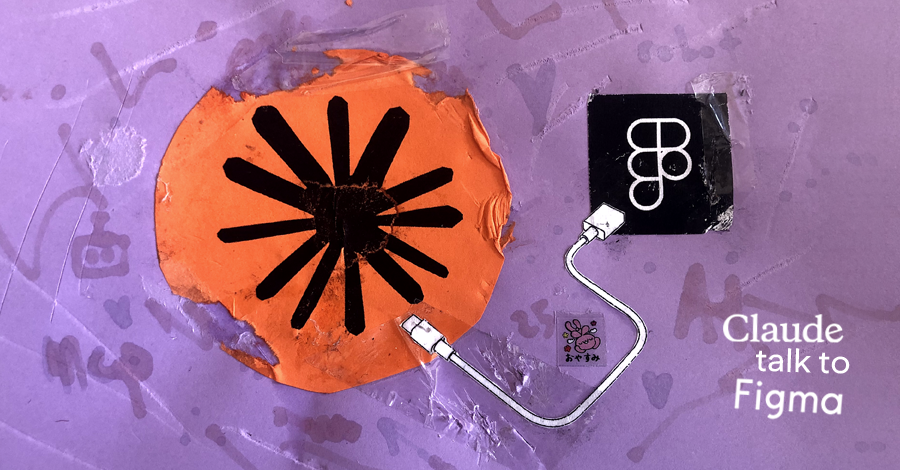
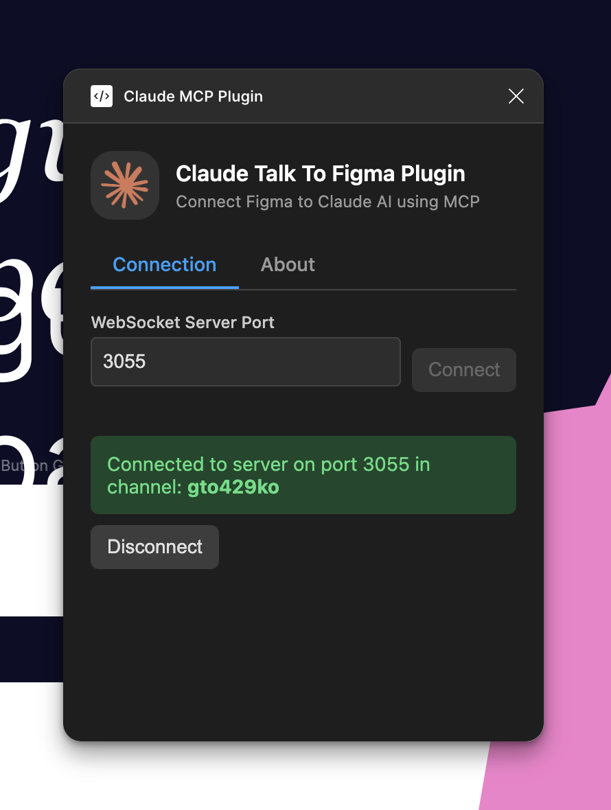

# Claude Talk to Figma MCP

A Model Context Protocol (MCP) plugin that allows Claude Desktop and other AI tools (GitHub Copilot, Cursor, etc.) to interact directly with Figma, enabling powerful AI-assisted design capabilities.

> **Important**: This project is based on [cursor-talk-to-figma-mcp](https://github.com/sonnylazuardi/cursor-talk-to-figma-mcp) by Sonny Lazuardi. It has been adapted to work with Claude Desktop instead of Cursor and the modification tools have been expanded. The original implementation and main credit belongs to Sonny Lazuardi ❤️

## 🚀 Features

- **Native Claude Integration**: Allows Claude to communicate with Figma through the Model Context Protocol (MCP)
- **Powerful Commands**: Manipulate objects in Figma, get information, create and modify elements
- **Advanced Text & Font Control**: Comprehensive text styling capabilities including font selection, spacing, and text effects
- **Bidirectional Communication**: Real-time WebSocket channel between Claude and Figma
- **Fluid Experience**: Design with AI as your assistant, accelerating creative workflows
- **Text Scanning**: Identify and manipulate text nodes within Figma documents
- **Remote Components**: Access and utilize components from team libraries
- **Modular Architecture**: Clean separation of concerns with specialized tool modules
- **Enhanced Error Handling**: Robust timeout and error recovery mechanisms
- **Performance Optimizations**: Improved handling of complex operations with chunking and batching

## 📋 Prerequisites

- [Claude Desktop](https://claude.ai/download) installed
- [Figma Desktop](https://www.figma.com/downloads/) installed
- [Figma](https://figma.com) account
- [Bun](https://bun.sh) v1.0.0 or higher 
  - Linux macOS ```curl -fsSL https://bun.sh/install | bash```
  - Windows ```powershell -c "irm bun.sh/install.ps1 | iex"```

## ⚙️ Installation

1. Clone this repository:
   ```bash
   git clone https://github.com/arinspunk/claude-talk-to-figma-mcp.git
   cd claude-talk-to-figma-mcp
   ```

2. Install dependencies:
   ```bash
   bun install
   ```

3. Build the project:
   ```bash
   bun run build
   ```

4. Configure the MCP in Claude Desktop:
   ```bash
   bun run configure-claude
   ```
   Restart Claude Desktop if it was open.

   > **Note**: This script does the following:
   
   - Locates the Claude Desktop configuration file:
     - On macOS: `~/Library/Application Support/Claude/claude_desktop_config.json`
     - On Windows: `%APPDATA%\Claude\claude_desktop_config.json`
   - Creates a backup of the existing configuration file
   - Modifies or creates the configuration file to include "ClaudeTalkToFigma" in the list of MCPs
   - Configures the command that Claude Desktop should execute to start the MCP

5. Install the Figma plugin:
   
   > **Note**: This project uses a custom Figma plugin located in the `src/claude_mcp_plugin` folder.

   - Open Figma
   - Go to **Menu > Plugins > Development**
   - Select "Import plugin from manifest"
   - Navigate and select the `src/claude_mcp_plugin/src/claude_mcp_plugin/manifest.json` file from this repository

   The plugin will appear in your development plugins list and you can use it like any other plugin.

## 🚀 Usage

### 🔌 Starting Up

Once installed, you just need to start it:

1. **Start the WebSocket server**:
   ```bash
   bun socket
   ```
   Verify it's running with `http://localhost:3055/status`
   
   > **Note**: if for any reason you need to stop the server, press `Ctrl+C` in the terminal.

3. **Connect the plugin to the server**:

   Open the Claude MCP Plugin in Figma and copy the channel ID generated to provide it to Claude.

   

4. **Claude Desktop**:

   Open Claude Desktop and confirm that "ClaudeTalkToFigma" appears in the MCPs selector.

5. **Ready to use!**

   Now you can send commands to Figma from Claude.

### 🧠 Prompting

1. Before you start designing with Claude, [make it an expert in UX/UI](prompts/prompt-ux-ui-specialist.md) 🎨
   
   > **Note**: Also in [Galician](prompts/prompt-ux-ui-especialista-gal.md), [Português](prompts/prompt-ux-ui-especialista-pt.md) and [Español](prompts/prompt-ux-ui-especialista-es.md).

2. Now tell Claude to connect to your Figma project:
   ```
   Talk to Figma, channel {channel-ID}
   ```

## 🏛️ Architecture

```
+----------------+     +-------+     +---------------+     +---------------+
|                |     |       |     |               |     |               |
| Claude Desktop |<--->|  MCP  |<--->| WebSocket Srv |<--->| Figma Plugin  |
|   (AI Agent)   |     |       |     |  (Port 3055)  |     |  (UI Plugin)  |
|                |     |       |     |               |     |               |
+----------------+     +-------+     +---------------+     +---------------+
```

### Design Principles

The system follows a clear separation of concerns:

- **MCP Server**: Handles business logic, validation, and default values
- **WebSocket Server**: Routes messages between components  
- **Figma Plugin**: Pure translator that executes commands in Figma

This approach ensures that each layer has a single responsibility, making the system more reliable and easier to maintain.

### Project Structure

```
src/
  talk_to_figma_mcp/     # MCP Server implementation
    server.ts            # Main entry point
    config/              # Server configuration
    tools/               # Tool categories by function
      index.ts           # Tool registration
      document-tools.ts  # Document interaction tools
      creation-tools.ts  # Shape and element creation tools
      modification-tools.ts # Property modification tools
      text-tools.ts      # Text manipulation tools
      component-tools.ts # Component handling tools
    utils/               # Shared utilities and helpers
      defaults.ts        # Safe default value handling
      websocket.ts       # WebSocket communication
      logger.ts          # Logging system
      figma-helpers.ts   # Figma-specific helpers
    types/               # TypeScript type definitions
      color.ts           # Color type definitions
  claude_mcp_plugin/     # Figma plugin
    code.js              # Plugin implementation
    manifest.json        # Plugin configuration
    ui.html              # Plugin UI
```

Benefits of this structure:
- **Clear ownership**: Each component has well-defined responsibilities
- **Easy testing**: Components can be tested in isolation
- **Maintainable**: Changes to one layer don't affect others

## 🛠️ Available Commands

As Claude is connected to our MCP, it already knows the list of tools to manipulate Figma. But if you want, you can mention them in your prompts:  

### Document Tools
- `get_document_info`: Get detailed information about the current Figma document
- `get_selection`: Get information about the current selection in Figma
- `get_node_info`: Get detailed information about a specific node in Figma
- `get_nodes_info`: Get detailed information about multiple nodes in Figma
- `get_styles`: Get all styles from the current Figma document
- `get_local_components`: Get all local components from the Figma document
- `get_remote_components`: Get available components from team libraries in Figma
- `scan_text_nodes`: Scan all text nodes in the selected Figma node
- `join_channel`: Join a specific channel to communicate with Figma
- `export_node_as_image`: Export a node as an image from Figma

### Creation Tools
- `create_rectangle`: Create a new rectangle in Figma
- `create_frame`: Create a new frame in Figma
- `create_text`: Create a new text element in Figma
- `create_ellipse`: Create a new ellipse or circle in Figma
- `create_polygon`: Create a new polygon with customizable sides in Figma
- `create_star`: Create a new star with customizable points in Figma
- `create_vector`: Create a new vector shape in Figma
- `create_line`: Create a new line in Figma
- `group_nodes`: Group multiple nodes together in Figma
- `ungroup_nodes`: Ungroup nodes in Figma
- `clone_node`: Clone an existing node in Figma
- `insert_child`: Insert a child node inside a parent node in Figma
- `flatten_node`: Flatten a node in Figma (e.g., for boolean operations)

### Modification Tools
- `set_fill_color`: Set the fill color of a node in Figma
- `set_stroke_color`: Set the stroke color of a node in Figma
- `move_node`: Move a node to a new position in Figma
- `resize_node`: Resize a node in Figma
- `delete_node`: Delete a node from Figma
- `set_corner_radius`: Set the corner radius of a node in Figma
- `set_auto_layout`: Configure auto layout properties for a node in Figma
- `set_effects`: Set visual effects (shadows, blurs) for a node in Figma
- `set_effect_style_id`: Apply an effect style to a node in Figma

### Text Tools
- `set_text_content`: Set the text content of an existing text node in Figma
- `set_multiple_text_contents`: Set multiple text contents parallelly in a node
- `set_font_name`: Set the font name and style of a text node in Figma
- `set_font_size`: Set the font size of a text node in Figma
- `set_font_weight`: Set the font weight of a text node in Figma
- `set_letter_spacing`: Set the letter spacing of a text node in Figma
- `set_line_height`: Set the line height of a text node in Figma
- `set_paragraph_spacing`: Set the paragraph spacing of a text node in Figma
- `set_text_case`: Set the text case of a text node in Figma
- `set_text_decoration`: Set the text decoration of a text node in Figma
- `get_styled_text_segments`: Get text segments with specific styling in a text node
- `load_font_async`: Load a font asynchronously in Figma

### Component Tools
- `create_component_instance`: Create an instance of a component in Figma

## 📝 CHANGELOG

See [CHANGELOG.md](CHANGELOG.md) for a detailed history of changes.

### Current version: 0.5.2

- **Critical Bug Fixes**: Fixed opacity and stroke weight handling in `set_stroke_color` where falsy values were incorrectly converted
- **Architectural Improvements**: Extended safe defaults pattern across all color operations with consistent MCP/Plugin separation
- **Enhanced Testing**: Comprehensive test coverage for stroke operations and edge cases
- **Code Quality**: Improved type safety, validation, and error handling throughout the system

For more details about previous and complete changes, check the [CHANGELOG.md](CHANGELOG.md).

## 🐛 Troubleshooting

If you encounter problems, check the following common issues:

### Common Issues

- **Connection Error**: Make sure the WebSocket server is running with `bun socket`
- **Plugin Not Appearing**: Verify that you've correctly linked the plugin folder in Figma Development settings
- **Claude Can't Find the MCP**: Make sure you've run `bun run configure-claude` and restarted Claude Desktop
- **Claude Not Responding**: Confirm you've selected "ClaudeTalkToFigma" in the MCPs menu
- **Execution Errors**: Check the Figma development console for detailed messages
- **Font Loading Issues**: Some fonts might not be available in Figma. Use `load_font_async` to verify font availability
- **Remote Components Error**: Team libraries might require proper permissions in Figma. Ensure you have access to the libraries you're trying to use

## 🧪 Testing

The project includes two complementary testing approaches:

### Automated Tests

For unit and component integration tests:

```bash
bun run test            # Run all automated tests
bun run test:watch      # Run tests in watch mode
bun run test:coverage   # Run tests with coverage report
```

### Manual Integration Tests

For end-to-end functionality testing between Claude, WebSocket server, and Figma:

```bash
bun run test:integration
```

This script guides you through testing the complete integration workflow.

For more comprehensive testing documentation, see [TESTING.md](TESTING.md).

## 🤝 Contributions

Contributions are welcome. Please follow these steps:

1. Fork the repository
2. Create a branch for your feature (`git checkout -b feature/amazing-feature`)
3. Commit your changes (`git commit -m 'Add some amazing feature'`)
4. Push to the branch (`git push origin feature/amazing-feature`)
5. Open a Pull Request

### Contributors

- **[Taylor Smits](https://github.com/smitstay)** - Fixed opacity handling in color functions and added automated tests ([PR #13](https://github.com/arinspunk/claude-talk-to-figma-mcp/pull/13), [PR #14](https://github.com/arinspunk/claude-talk-to-figma-mcp/pull/14))

## 📄 License

This project is under the MIT License - see the [LICENSE](LICENSE) file for details.

## 👥 Authors

- **Xúlio Zé** - *Adaptation for Claude* - [GitHub](https://github.com/arinspunk)
- **Sonny Lazuardi** - *Original Cursor implementation* - [GitHub](https://github.com/sonnylazuardi)

## 🙏 Acknowledgments

- Anthropic team for Claude and the Model Context Protocol
- Figma community for their excellent plugin API
- Sonny Lazuardi for the original Cursor Talk to Figma MCP implementation
- Bun team for providing a fast JavaScript runtime
