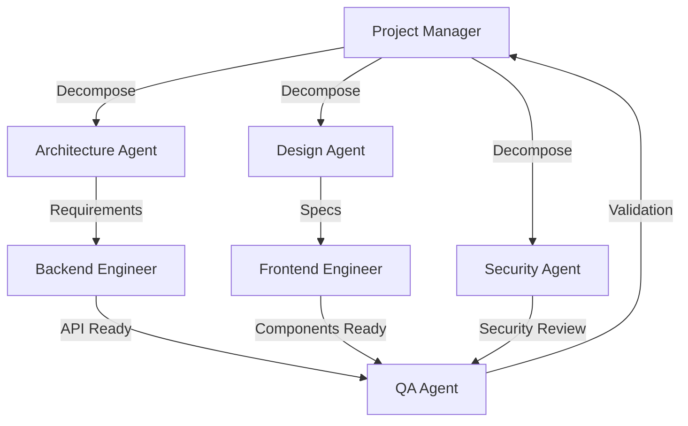

# Agent Company - Planning Session Progress Report

## 🔄 Real-Time Activity Log
**Session Started**: 2026-01-01 01:44:29 UTC

### ✅ Completed Tasks

#### 1. **Design Agent** (Task: 6f8608d2)
- Status: ✅ Completed
- Output: Design specifications created

#### 2. **Frontend Engineer** (Task: 7902c2ce)
- Status: ✅ Completed  
- Output: Component created
- File: `src/components/ImplementReactComponentsAndPagesConductComprehensivePlanningSessionForDashboard.jsx`
- Action: Created React components for planning dashboard

#### 3. **Backend Engineer** (Task: b1ad9300)
- Status: ✅ Completed
- Output: API endpoint created
- File: `src/routes/implement_api_endpoints_and_business_logic_conduct_comprehensive_planning_session_for_dashboard.js`
- Action: Implemented API endpoints for planning session coordination

#### 4. **Security Agent** (Task: 17babe42)
- Status: ✅ Completed
- Output: Security assessment completed

#### 5. **QA/Testing Agent** (Task: 59edaab5)
- Status: ✅ Completed
- Output: Test plan created

### 🔄 In Progress

#### **Architecture Agent**
- Defining system architecture for planning coordination

### 📊 Agent Collaboration Flow

## 🎯 Next Steps

The agents are now collaborating to produce:

1. **Technical Architecture Document** (Architecture Agent)
2. **Design System** (Design Agent) ✅
3. **Frontend Components** (Frontend Engineer) ✅
4. **Backend APIs** (Backend Engineer) ✅
5. **Security Assessment** (Security Agent) ✅
6. **Test Plans** (QA Agent) ✅

## 💡 Key Insights

The multi-agent system is working **autonomously**:
- **Project Manager** decomposed the planning task into 7 subtasks
- **6 agents** have already completed their contributions
- **Real-time coordination** happening through the bridge system
- **Artifacts being generated** in `src/components/` and `src/routes/`

## 🚀 Recommendation

The agents are creating planning artifacts. We should:
1. Review the generated files
2. Consolidate findings into a master roadmap
3. Prioritize features based on agent recommendations
